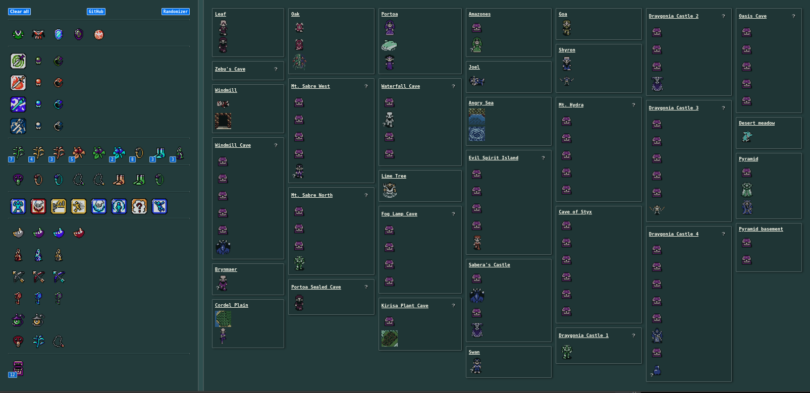
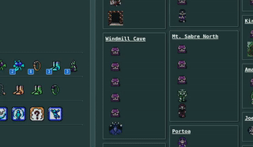
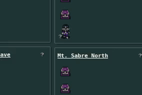

# Crystalis Randomizer Tracker

This is a web-based item tracker for the
[Crystalis randomizer](https://crystalisrandomizer.com). It uses 
`localStorage` to persist the data. Internet-accessible instance is 
[here](https://crystalistracker.tmont.com/).

Running it locally requires Node.js. Install that and then run:

1. `npm install`
2. `npm run build`
3. `npm start`
4. Visit http://localhost:3000/

## Usage
Drag items from the left to the locations you found them on the right. If you
drop it in the wrong spot, click on it to remove it and put it back in the
item pool on the left. Consumable items like Medical Herbs can be found in
multiple places. They have a counter indicating how many are remaining to
find. At the moment it's accurate but if the randomizer changes how many
of those items are available then it won't work. Maybe create an issue
or something if that happens.

Note that the [latest](https://crystalisrandomizer.com/latest) version of
the randomizer is not compatible with this tracker, as it adds new item
locations.

You can also track trade-in items and breakable wall requirements if the
relevant flags are set. Click on the "?" to set the required item or sword.
Can be handy particularly for remembering which sword is needed to break walls 
in an area.

## Alternatives
I didn't realize there was already one built into the randomizer website
[here](https://crystalisrandomizer.com/track). Once you set all the flags
on the other page it fills everything in automatically. It's also smaller
and almost certainly better and has a map and stuff which is neat.

But I had a good time slicing sprites and stuff so it wasn't a total waste.
